<!--
  GitHub Profile README — MD. Siyamul Islam
  Visuals live in ./assets.
-->

  

**I like understanding how things work — and then building something with that understanding.**

 

## About me

I'm **Siyam**, an Electrical & Electronic Engineering student at **Uttara University** with a growing interest in software engineering, AI, embedded systems, robotics, and automation.

EEE gave me a foundation in electronics, circuits, signals, systems, and how hardware behaves in the real world. Software pulled me in because it gives me a way to turn ideas into systems that can be changed, tested, and improved quickly.

So rather than choosing between hardware and software, I'm exploring the space where they meet.

|                         |                                                                                        |
| ----------------------- | -------------------------------------------------------------------------------------- |
| **Studying**            | BSc in Electrical & Electronic Engineering                                             |
| **Learning now**        | JavaScript, TypeScript, React, Node.js, DSA in C++                                     |
| **Building toward**     | Software Engineering, AI/ML, Embedded Systems, Robotics & Automation                   |
| **Exploring**           | Python, intelligent systems, computer engineering concepts, real-world IoT             |
| **Long-term direction** | Building useful engineering products and eventually turning ideas into real businesses |
| **Open to**             | Learning, collaboration, engineering discussions, and practical projects               |

 

## My direction

I'm building my skills step by step rather than trying to master everything at once.

  

The direction is:

`EEE` → `Software Engineering` → `AI / ML` → `Embedded Systems` → `Robotics & Automation` → `Real-world Products`

This is a long-term path. Some areas are current skills, some are active learning, and some are future exploration.

 

## Why I combine EEE + Software

For me, the two sides solve different parts of the same problem.

| EEE / Electronics                   | Software Engineering                            | AI / ML                                      |
| ------------------------------------ | ------------------------------------------------ | ---------------------------------------------- |
| Understand the physical system      | Build the logic and applications                | Make systems more data-driven and adaptive   |
| Sensors, circuits, signals, control | Algorithms, APIs, applications, backend systems | Patterns, predictions, intelligent decisions |
| Hardware interaction                | Digital systems and automation                  | Smarter behaviour                            |

`sense` → `process` → `decide` → `act` → `report`

That system-level thinking is what interests me most.

 

## Current learning stack

  

 

| Area                | Technologies                           | Current focus                                         |
| -------------------- | ---------------------------------------- | -------------------------------------------------------- |
| **Programming**     | C, C++, JavaScript, TypeScript, Python | Fundamentals, problem solving and clean logic         |
| **Web**             | HTML, CSS, React, Vite, Tailwind CSS   | Frontend development and modern UI                    |
| **Backend**         | Node.js, Express, REST APIs, MongoDB   | Learning backend development and data flow            |
| **Problem Solving** | DSA in C++, JavaScript                 | Building stronger algorithmic thinking                |
| **Embedded**        | ESP32, Arduino, sensors, actuators     | Connecting software with physical systems             |
| **Exploring**       | AI/ML, robotics, automation            | Learning how intelligent systems can work in practice |
| **Tools**           | Git, GitHub, VS Code                   | Version control, project workflow and documentation   |

 

## Projects

<table>
<tr>
<td width="50%" valign="top">

### Smart Irrigation & IoT Automation

`In development`

A practical IoT project focused on using sensors, an ESP32-based controller, and automation to manage irrigation more intelligently.

The goal is not just to make a prototype work, but to understand the full engineering process — hardware, software, control logic, monitoring, testing, and future improvements.

ESP32 · IoT · Sensors · Automation · Embedded Systems

  

<a href="https://github.com/codewithsiyam/smart-irrigation-iot">View repository →</a>

</td>

<td width="50%" valign="top">

### JavaScript Problem Solving

`Ongoing`

A collection of regular problem-solving practice covering JavaScript fundamentals, functions, arrays, objects, ES6+ concepts, and related programming exercises.

The purpose is simple: understand the logic behind the code instead of only learning syntax.

JavaScript · TypeScript · Logic · Problem Solving

  

<a href="https://github.com/codewithsiyam/javascript-problem-solving">View repository →</a>

</td>
</tr>

<tr>
<td width="50%" valign="top">

### Software Engineering Projects

`Building step by step`

Small and medium projects built while learning frontend, backend, APIs, databases, and software development workflows.

Each project is mainly about learning by actually building.

Web · Backend · APIs · Databases

</td>

<td width="50%" valign="top">

### Embedded & Robotics

`Coming up`

Future projects around microcontrollers, sensors, motors, control systems, automation, and the interaction between software and physical devices.

Embedded · Robotics · Control · Automation

</td>
</tr>
</table>

 

## How I learn and build

  

 

I try to follow a simple engineering approach:

**Understand → Learn the fundamentals → Build → Test → Debug → Improve → Repeat**

I prefer small working systems over trying to build something huge without understanding the pieces underneath.

That applies to both software and hardware.

 

## What I'm working toward

The immediate goal is to become a strong **software engineer** while continuing to use my EEE background as an advantage.

Over time, I want to work deeper in:

`Software Engineering`
`AI / Machine Learning`
`Backend Systems`
`Embedded Systems`
`Robotics & Automation`
`IoT & Intelligent Devices`

The long-term idea is bigger than learning technologies individually.

I want to understand enough across these areas to build systems that solve real problems — from software and automation tools to intelligent hardware and connected devices.

And eventually:

`problem` → `research` → `prototype` → `test` → `iterate` → `product`

My interest in entrepreneurship comes from the same place: building useful things first, then figuring out how they can become sustainable products or businesses.

 

## GitHub activity

I'm using GitHub seriously from **2026** as a place to learn in public, keep my projects organized, practice version control, and document progress.

  
  

 

## Connect

I'm interested in software, embedded systems, AI, robotics, automation, and practical engineering projects.

I'm also interested in meeting people who are learning, building, experimenting, or working across the hardware–software boundary.

  

